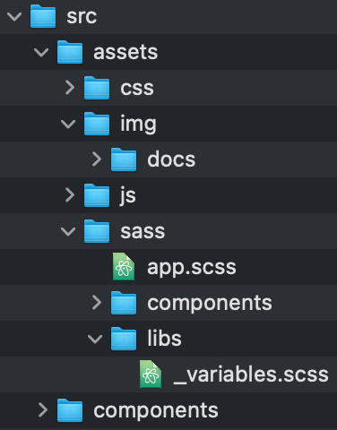

# Workflow to create frontend with ReactJS

##### Initialize the project. 

```shell
$ npx create-react-app 99-practice-jp
```

##### Install Bootstrap for ReactJS.

```shell
$ npm install react-bootstrap bootstrap
```

##### Structure public folders.

Create the folders `css`,` js`, `scss` and` img`, inside `assets` en and` components` inside `src`.

Al no estar en public, estos recursos se tienen que compilar. Para eso hay que importarlos. ej

Import Photo from '../ assets/img/photo.jpg';
y se llama así


<!-- Meter los js dentro de components y los sass dentro de assts -->
el guión bajo dentro en los _scss es para que se compilen dentro de un mismo archivo.

##### Compose the main sections.

> Create the JS files of the components and import them.

In main file. e.g.: <u>app.js</u>

```jsx
// Components.
import Menu from './Menu';
import Main from './Main';
import Footer from './Footer';

function App() {
  return (
    <div className="App">
      <Menu />
      <Main />
      <Footer />
    </div>
  );
}

export default App;
```

Create the components in `assets/components`. e.g.: <u>Menu.js</u>

> Idem in the other componets. e.i.: Main.js, Footer.js.

```jsx
const Main = (props) => {
  return <p>Hello, {props.name}</p>;
};

export default Main;
```

##### Create the CSS for each section.

Import and create a css for each component. e.g.: <u>Menu.css</u>

> Idem in the other componets. e.i.: Main.css, Footer.css.

```jsx
// CSS Custom Styles
import '../assets/css/Menu.css';
```

##### Pasar por props los valores de las tarjetas.

- [x] ActiveSubscription.json
- [ ] PopularSubscription.json
- [ ] Subscription.json


##### Armar el ruteador

> [Documentación](https://reactrouter.com/web/guides/quick-start) de react-router-dom

- [x] Setear el router en app.
- [ ] Falta ver que más ya que no puse ningún link aún.

El menú va a ser un componente de estado. 
En donde el estado va a estar pendiente de la ruta y de acuerdo a esta va a actuar distinto.

Paso obligatorio: en app.js hay que utilizar el browserrouter para anidar la <App> (para saber que la app está contenida en el ruteador)


Para eso usamos el useState para setear el estado.
También usamos el useEffect para estar pendiente el estado.
useHistory nos sirve para estar pendientes de los cambios de la url.

En cada <Link> le cambiamos el estado con setLocation con la nueva url.

Le pasamos al componente <Menu lo que capturamos de la URL como estado


Ahora de acuerdo al estado elejimos que mostrar. (si la url es X mostramos ESTO) eje. location === '/settings' ? 

 

useHistotory es un Hoock, por lo que necesito el useEffect de react por que es asíncrono y de esta forma yo se cuando se termina de montar. Ej

(useEfect está pendiente de los cambios del componentes y ciclo de vida del mismo.... por ejemplo cada vez que hago un click)
useEffect (() => {

console.log ('se montó el componente')


}, [location])

El impor en archivos Json ya viene parseado.


El console.log en react lo leo desde la consola del navegador

#### 


##### Install thrid-party dependencies.

* Font Awesome para react proyect. [Documentación](https://www.npmjs.com/package/@fortawesome/react-fontawesome)


##### Armar la DB como respuestas en Archivos JSON.

> Dejarlo como array en App.js

- [x] ActiveSubscription.json
- [ ] PopularSubscription.json
- [ ] Subscription.json

E.g. `App.js`.

```js
  Poner acá el ejemplo
```


#### Acomodar el css de las tarjetas
