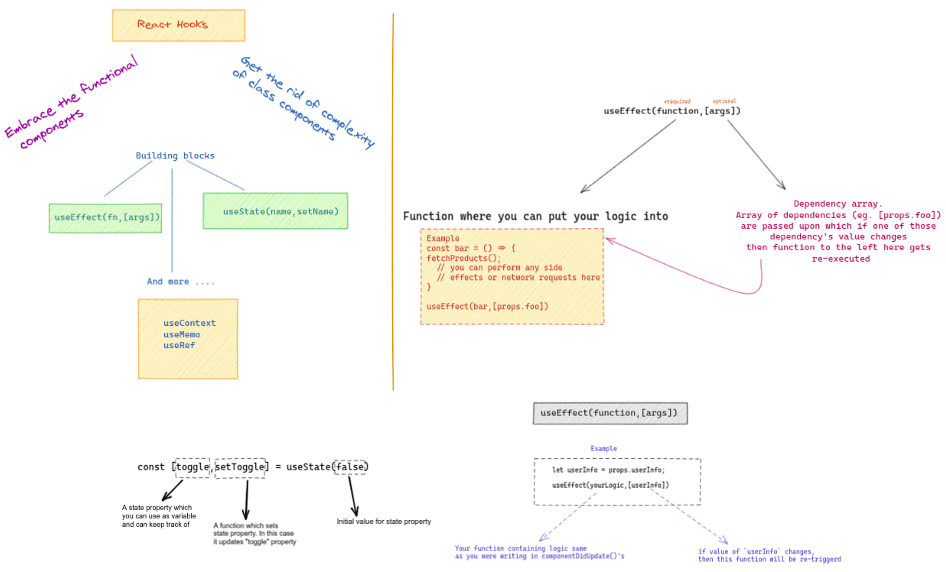
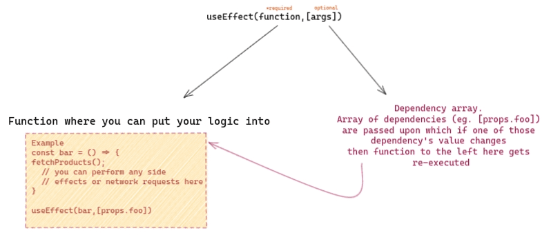
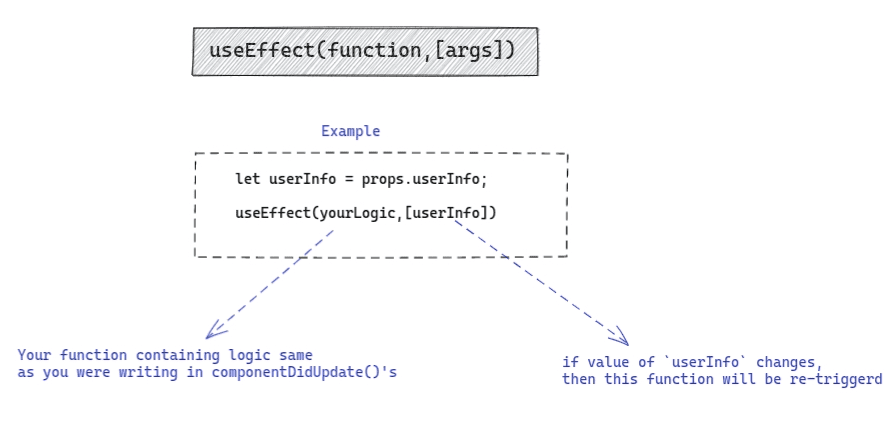

# Simplifying React Hooks 🔆

> This article was writted by Meet Zaveri.

**focuses on folks who are coming from class components**



Typical overview of what we are going to do in this post

In this article, I tried my best to make it easier for you to understand what are [react hooks](https://reactjs.org/docs/hooks-intro.html). I have written this for guys coming from traditional class component pattern who want to explore react hooks.

We’ll cover how to use `useState` , `useEffect()` and more techniques to simulate the experience you were having in class component era

## 🎣 Hooks and Class Components

Hooks don’t work inside classes and that gives us benefit of using them in functional component.

But what about [**lifecycles and state**](https://reactjs.org/docs/state-and-lifecycle.html) which we were leveraging in class components? Well, there is a way for replicating them in form of hooks.

> Hooks are functions that let you “hook into” React state and lifecycle  features from function components. Hooks don’t work inside classes, they let you use React without classes — React.js Official Documentation

## 🌟 Let’s talk about managing state: [useState](https://reactjs.org/docs/hooks-reference.html#usestate)

`useState` is a hook which helps us manage state.


You can get a glimpse from this above image as what `useState` hook offers. So when you call `setToggle(true)` then `toggle` value changes from `false` to `true`

If we were to replicate this into [**class component**](https://reactjs.org/docs/components-and-props.html#function-and-class-components) then, it would look like this

```js
class App extends React.Component{
	constructor(props){ 
  	super(props); 
		this.state={
      toggle:false 
    }
  }
  setfoggle = () => {
    this.setState({toggle:true})
  }
}
```

Unlike class, we can’t have multiple state properties into one object. We have to always create another set of `useState` for new state properties.

## How to use props?

As we know, functional components can access props by either passing it directly in function argument (eg: `MyComponent(props)`) or you can spread them for performance improvements (eg: `MyComponent({name,title})`)

So there’s no explicit API or section on how should we use props in react hooks.

## 🔗 APIs, where we should call them ?!

### Old Class-ical way

Usually we would write network requests(APIs) in `[componentDidMount](https://reactjs.org/docs/react-component.html#componentdidmount)` lifecycle which is the preferable one as per react documentation suggests.

```
componentDidMount(){
 this.props.getData()
}
```

But for hooks we have a similar way to do network requests in particular fashion.

### [useEffect](https://reactjs.org/docs/hooks-reference.html#useeffect)( )

As documentation says, *it’s a hook that lets you perform side effects.*

> Remember that any useEffect( ) hook will be called atleast once at time of render phase regardless of its arguments

We can call our APIs in `useEffect()` as following:

```js
import React, { useEffect } from 'react';
import ProfilePage from './ProfilePage';

const ProfileContainer = () => {

  useEffect(() => {
    fetch('/api/user') // perform any side effects or network requests
  }, []); // <-- empty array means 'run once'

  return <ProfilePage />;
};
```



So as you can see if we pass empty array `[]`in second argument of the function and it will be executed only once when that component **completes its first render.** This is because there're no values in array(i.e. second arg) to keep track of whether those values change or not.

Take a look at this scenario

1. useEffect with **no args**: This means function passed in `useEffect(fn)`will always trigger when there’s re-render of the component
2. useEffect with **empty arg**: This means function passed in `useEffect(fn,[name]`will trigger atleast once and after that it will trigger whenever the value supplied in argument( `[]`) of `useEffect(fn,[name]` changes. `name` here is just a variable containing value which we want to subscribe if it changes or not
3. useEffect with one or **more args:** This means function passed in `useEffect(fn,[name,title]`will trigger atleast once and after that it will trigger whenever the value(s) supplied in argument( `[]`) of `useEffect(fn,[name,title]` changes

You can read more about useEffect [here](https://reactjs.org/docs/hooks-effect.html)

### Wait, how can I listen to changes for props and state values?

The most common approach in class component for this use case was achieved using `componentDidUpdate`

```
componentDidUpate(prevProps,prevState){
  if(prevProps.data !== this.props.data){
    // do some action
  }
}
```

Discuss how `useEffect()` hook can be used for it

This can be achieved in hooks by writing your logic in function of`useEffect` and by passing your value on which you want to check if that changed in dependency array`[]`



Passing our logic into function and list of dependency(s) into dependency array will conclude that whenever any of the dependency(s)’s value changes,  then the function will be re-triggered hence our logic will be applied  as per old method in class component

```js
import React, { useEffect } from 'react';

const Container = () => {
  const userInfo = props.userInfo;
  const makeAPICall = () => {
    // do your async actions, side effects or network effects
  }
  useEffect(makeAPICall,[userInfo])
  return (<div>Example</div>);
};
```

> **Again, take note that this useEffect() will always be executed atleast once as I said earlier. This means that if your** `**props.userInfo**` **hasn’t changed then also your hook will be triggered.**

To overcome this, you could add extra condition in function which differentiates initial state(stale) of `props.userInfo`

### When can I know that my component is going to unmount?

This can also be achieved via passing `[]` empty args in useEffect with main function returning another function where we can have unmount logic in it

You will get clear understanding when you’ll try it with

```js
import React, { useEffect } from 'react';

const ProfileContainer = () => {

  // generally I prefer this as useEffect with empty args[]
  useEffect(() => {
    fetch('/api/user') // perform any side effects or network requests
    
    
    // you can have return() for this function which will be executed once component will unmount
    return () => {
      console.log('Unmounting ...');
      doYourUnmountProcess();
    }
  }, []); // <-- empty array means 'run once'

  return <div> Hello World </div>;
};
```

Note there are two things here. 1) the empty braces 2) return function to contain unmounting logic

This means this useEffect snippet will act like:

1. initial logic in function gets executed (as in component just mounted )
2. the logic inside return function gets executed when component is unmounted

### How can I wrap them ?

Same way as we did with class components. Yeah literally, we wrap as `authWrapper(Dashboard)` .
