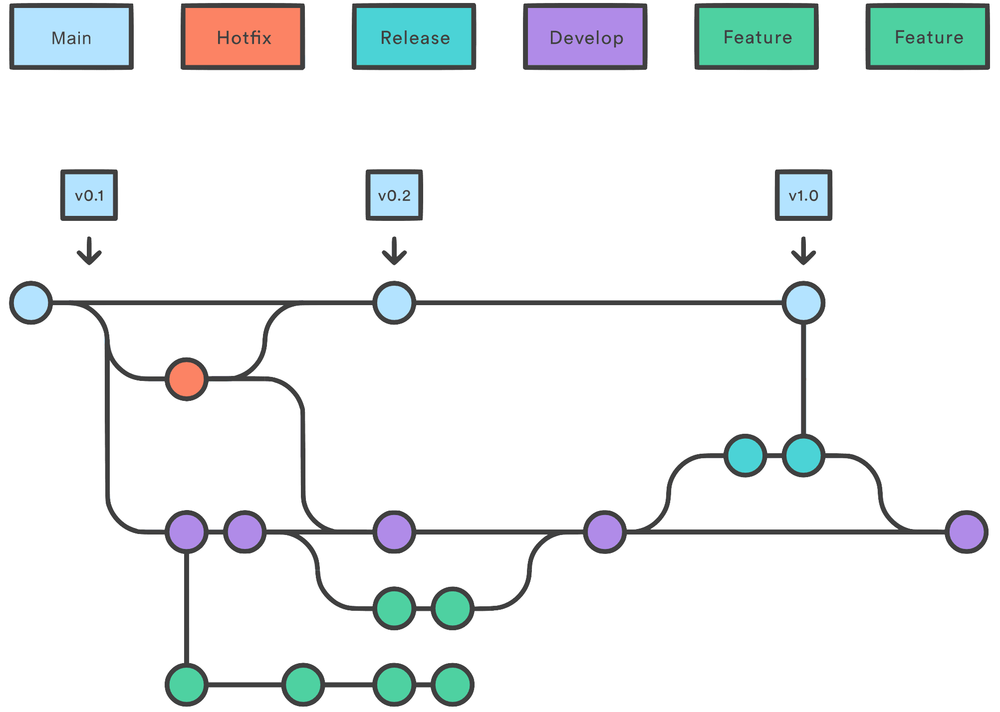
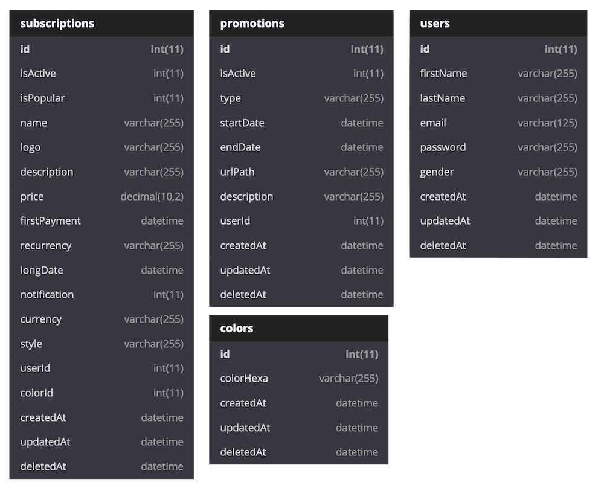
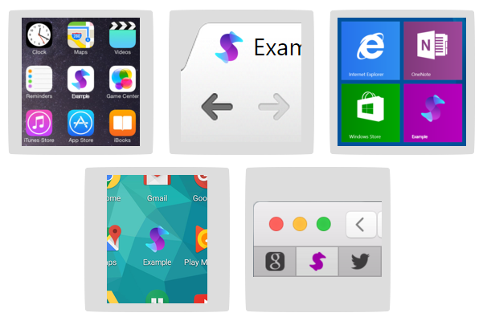

# Subscription App

> Use this app for manage yours subscriptions payments.

### 🚀 Quick Start

In server folder, create a `.env` file and copy the content from `.env.example`.

#### Things for the server

Install node dependences.

```shell
$ cd server
$ npm i
```

Turn on the server.

```shell
$ cd src
$ npm start
```

Create database.

```shell
$ npm run dbStart
```

Install React dependences.

```shell
$ cd ../../client
$ npm i
```

### Tecnologies

##### Main language:

> JavaScript


##### BackEnd:

> - Node.JS, Express.JS, MySQL, Sequelize.JS


##### FrontEnd:

> React.JS


##### DevOps:

- Gitflow Workflow: [GitFlow-English](./GitFlow-English.md), [GitFlow-English](./GitFlow-English.md)

  

#### Database.

> Database schema `subs_db`. Image generator: [diagram.io](https://dbdiagram.io)



#### Desing.
> FAVICON this icon was only an inspiration. 



### TO-DOs
> Server
- [x] Create Sass script.
- [x] Install React.
- [x] Create a Bitbuket Readme for the workflow.
- [x] Implemen git flow.
- [x] REST-API: Subscription methods.
- [x] REST-API: Promotions methods.
- [ ] Seeders: Insert initial colors in db from Json.
- [ ] Seeders: Insert initial brands in db from Json.
- [ ] REST-API: Use the colors, create relations between tables.
- [ ] REST-API: Validate incoming data for Subscription method (edit, create, delete).
- [ ] REST-API: Validate incoming data for promotion method (edit, create, delete).
- [ ] REST-API: User methods.
- [ ] REST-API: Do the mockups.

> Client
- [x] Install React.JS
- [x] Clear react.
- [x] Install Dependencies.
- [x] Ceate a folder structure.
- [x] Get main data from db using hooks.
- [x] Create main components using arrow funtions.
- [ ] Get brands of his website. https://www.npmjs.com/package/parse-favicon
- [ ] Update components with props.
- [x] Create a loading componets.
- [x] Implement Sass.
- [ ] Sass: variables.
- [ ] Sass: Media Queries Schema


### Author

Written by Devecchi Martinengo, Juan Pablo.

### License

MIT. See [LICENSE](server/LICENSE) for more details.

(Ends)