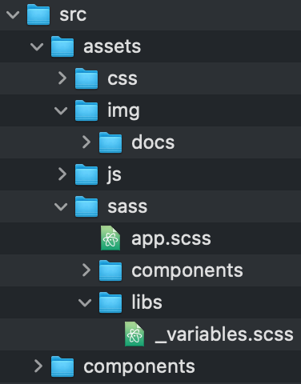

# :surfing_man: Workflow to create frontend with React.JS :surfing_man:


### Initialize the project.

```shell
$ npx create-react-app 99-practice-jp
```

### Structure public folders.

> This structure is more performant in <u>small projects</u> or with little information, so as not to overload the web.
>
> In <u>larger projects</u>, it is probably more performant to put `assets` in public.

Create the folders `css`,` js`, `sass` and` img`, inside `assets` and` components` inside `src`.



<!-- Al no estar en public, estos recursos se tienen que compilar. Para eso hay que importarlos. ej -->

<!--Import Photo from '../ assets/img/photo.jpg';
y se llama así


##### Compose the main sections.

> Create the JS files of the components and import them.

In main file. e.g.: <u>app.js</u>

```jsx
// Components.
import Menu from './Menu';
import Main from './Main';
import Footer from './Footer';

function App() {
  return (
    <div className="App">
      <Menu />
      <Main />
      <Footer />
    </div>
  );
}
export default App;
```

Create the components in `assets/components`. e.g.: <u>Menu.js</u>

> Idem in the other componets. e.i.: Main.js, Footer.js.

```jsx
const Main = (props) => {
  return <p>Hello, {props.name}</p>;
};
export default Main;
```

##### Create the SASS for each section.

Create a SASS for each component. e.g.: <u>Menu.scss</u>

> Idem in the other componets. e.i.: Main.scss, Footer.scss and the others components

```jsx
// CSS Custom Styles   <<<<< Acá hay que cambiar de SASS a CSS >>
import '../assets/css/Menu.css';
```

- [ ] Definir que cosas pueden ser variables en SASS.
- [ ] Compilar SASS

<!-- El formato en filas para escribir en el HTML o Boostrap solo lo hago cuando hay algo dinámico. -->

Para compilar usar un packete --> sass -g
Configurarlo en los scripts del package.json (ver fromSassToCss)

```shell
$ npm run fromSassToCss
```

--watch (usado en el package.json) queda escuchando los cambios :D

Practicar hooks:

- Hacer un proyecto aparte.

##### Create JSON file for DB Test.

Create and import DB in main file. e.g.: <u>app.js</u>

```jsx
// Database for test.
import ActiveSubscriptionDB from '../data/ActiveSubscription.json';
import PopularSubscriptionDB from '../data/PopularSubscription.json';
import SubscriptionDB from '../data/Subscription.json';
```

##### Pasar por props los valores de las tarjetas.

- [x] ActiveSubscription.json
- [ ] PopularSubscription.json
- [ ] Subscription.json

##### Armar el ruteador

> [Documentación](https://reactrouter.com/web/guides/quick-start) de react-router-dom

- [x] Setear el router en app.
- [ ] Falta ver que más ya que no puse ningún link aún.

El menú va a ser un componente de estado.
En donde el estado va a estar pendiente de la ruta y de acuerdo a esta va a actuar distinto.

Paso obligatorio: en app.js hay que utilizar el browserrouter para anidar la <App> (para saber que la app está contenida en el ruteador)

Para eso usamos el useState para setear el estado.
También usamos el useEffect para estar pendiente el estado.
useHistory nos sirve para estar pendientes de los cambios de la url.

En cada <Link> le cambiamos el estado con setLocation con la nueva url.

Le pasamos al componente <Menu lo que capturamos de la URL como estado

Ahora de acuerdo al estado elejimos que mostrar. (si la url es X mostramos ESTO) eje. location === '/settings' ?

useHistotory es un Hoock, por lo que necesito el useEffect de react por que es asíncrono y de esta forma yo se cuando se termina de montar. Ej

(useEfect está pendiente de los cambios del componentes y ciclo de vida del mismo.... por ejemplo cada vez que hago un click)
useEffect (() => {

console.log ('se montó el componente')

}, [location])

El impor en archivos Json ya viene parseado.

El console.log en react lo leo desde la consola del navegador

####

##### Install thrid-party dependencies.

- Font Awesome para react proyect. [Documentación](https://www.npmjs.com/package/@fortawesome/react-fontawesome)


# This article is in progress


